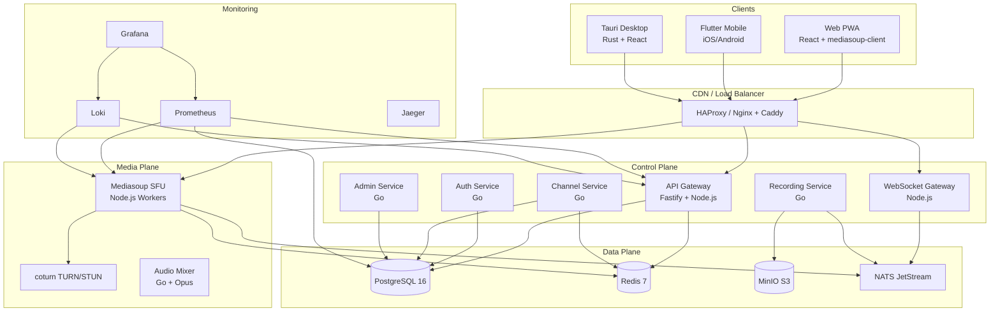
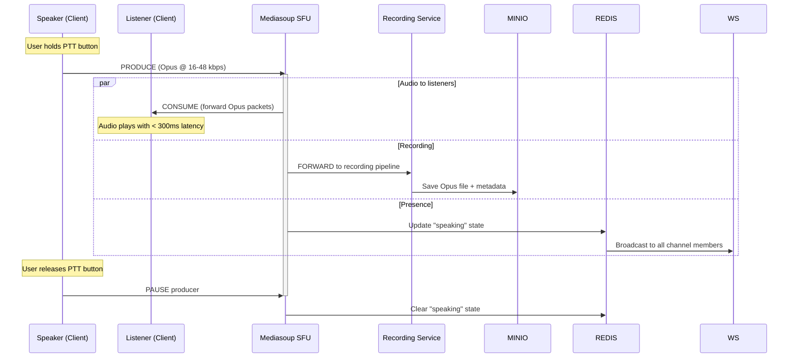
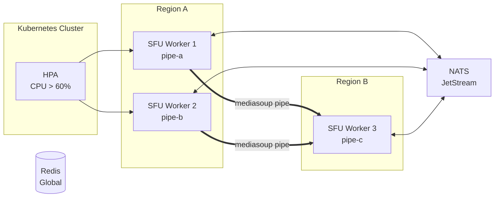
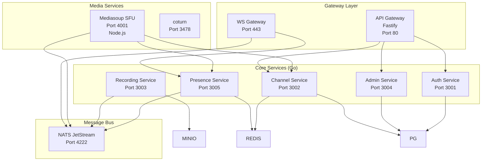
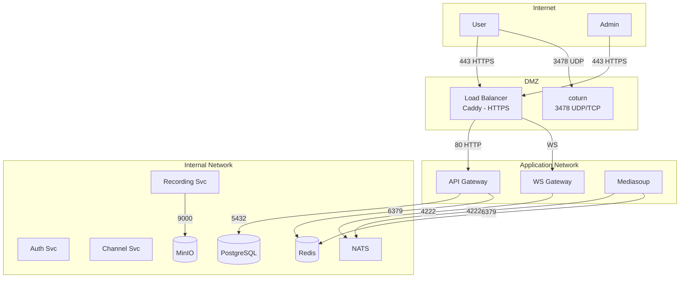
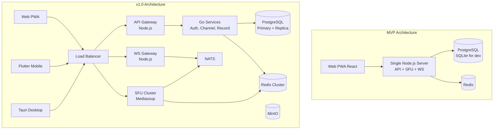

# VoxRelay — Архитектура

---

## 1. Высокоуровневая архитектура



---

## 2. Аудио-пайплайн (передача голоса)



**WebRTC Audio Flow (подробно):**

```
┌──────────────┐         ┌──────────────┐         ┌──────────────┐
│  Speaker     │         │  Mediasoup   │         │  Listener    │
│  Client      │         │  SFU Worker  │         │  Client      │
├──────────────┤         ├──────────────┤         ├──────────────┤
│ getUserMedia ├────────>│ router      ├────────>│ mediasoup    │
│ ↓            │  UDP    │  │          │  UDP    │ -client      │
│ OpusEncoder  │  RTP    │  Producer  │  RTP    │ ↓            │
│ ↓            │         │  → pipe    │         │ OpusDecoder  │
│ RTCRtpSender │────────>│  → Consumer│────────>│ ↓            │
│              │         │             │         │ AudioContext │
│ DTX/CNG      │         │ Simulcast  │         │ Gain/Volume  │
│ FEC (RED)    │         │ ABR Adapt  │         │ JitterBuffer │
└──────────────┘         └──────────────┘         └──────────────┘
```

---

## 3. Масштабирование: Distributed SFU



**Ключевые механизмы масштабирования:**

| Механизм | Описание |
|----------|----------|
| **Горизонтальное масштабирование SFU** | Mediasoup Router-per-room. Каждый worker — отдельный процесс (Node.js worker_threads). При достижении лимита — новый worker. |
| **Pipe транспорт** | Mediasoup pipe для соединения SFU в разных регионах. Аудио идёт через pipe, listeners получают от ближайшего SFU. |
| **Global Redis** | Состояния пользователей (presence) реплицируются через Redis Cluster. |
| **NATS JetStream** | События (user joined, started speaking, recording) проходят через NATS — гарантированная доставка, replay для новых подписчиков. |
| **K8s HPA** | Автоматическое масштабирование по CPU/RAM. SFU workers эфемерны — перенос комнат через drain. |

---

## 4. Компонентная архитектура сервисов



---

## 5. Отказоустойчивость

### Стратегия

| Сценарий | Решение |
|----------|---------|
| Отказ SFU | Клиент переподключается к другому SFU через signaling. Аудио теряется только на время ICE-reconnect (< 1s). |
| Отказ сервиса | Каждый сервис stateless (кроме SFU). K8s перезапускает pod. Graceful shutdown + drain connections. |
| Отказ базы данных | PostgreSQL с Patroni (HA). Redis Cluster с репликами. Автоматический failover. |
| Потеря сети клиентом | Буферизация на клиенте (offline queue). После восстановления — replay. |
| Потеря пакетов | Opus FEC + RED + retransmission через NACK. Автоматическое снижение битрейта. |
| NAT traversal | TURN сервер как fallback. ICE + STUN для p2p. |

### SLA Target

| Метрика | MVP | v1.0 | v2.0 |
|---------|-----|------|------|
| Availability | 99.0% | 99.9% | 99.99% |
| Audio latency (RTT) | < 400ms | < 200ms | < 100ms |
| Max users per channel | 50 | 500 | 10,000 |
| Recording retention | 7 days | 30 days | 365 days |

---

## 6. Сетевая архитектура безопасности



**Политики сети (K8s Network Policies):**

- DMZ → Application: только 80/443
- Application → Internal: только необходимые порты
- Internal → Internal: pg (5432), redis (6379), nats (4222), minio (9000)
- Никакой сервис в DMZ не имеет прямого доступа к Internal network
- SFU (Media) изолирован от Database
- JWT подписывается Auth Service — API Gateway только валидирует

---

## 7. MVP vs v1.0 Архитектура


